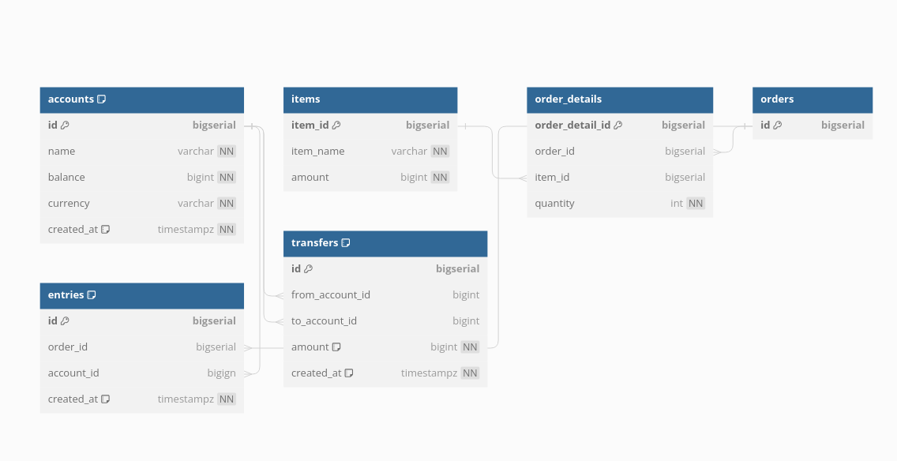

# Rest API
Using the common HTTP request patterns, it is possible to structure requests in a clear manner. The five following request types are used exclusively: GET, POST, PUT, PATCH, DELETE.

*Idempotent: An action if repeated multiple times should produce the same result.*

- GET: Used for non-modifying tasks, commonly reads. It should be free of side-effects, and also be idempotent.
- POST: Used to create new data, used most commonly at a common endpoint such as /blogs, but can also be used for adding a new resource to e.g. blogs/id/5, however less idiomatic.
- PUT: Used to update existing data. In contrast to POST it is idempotent. It is less commonly used to create new data as such operations should go through an appropiate handler. 
- PATCH: Update subset of data and leaves unspecified fields unchanged.
- DELETE: Used most commonly to delete a specific resource.

## URL best practices
An URL should describe the entity using easy to understand words. An url enpoint for users should be in lowercase and pluralized in order to be considered idiomatic.

## Backward and forward compatability

## Request caching

## Create Entity-Relationship Diagrams
[dbdigram](https://dbdiagram.io/home)

Dbdigram uses database themarkup language (DBML) syntax.

[DBML docs](https://dbml.dbdiagram.io/docs/)

## Relationships



## PostgreSQL

```
CREATE TABLE "accounts" (
  "id" bigserial PRIMARY KEY,
  "name" varchar NOT NULL,
  "balance" bigint NOT NULL,
  "currency" varchar NOT NULL,
  "created_at" timestampz NOT NULL DEFAULT (now())
);

CREATE TABLE "items" (
  "item_id" bigserial PRIMARY KEY,
  "item_name" varchar NOT NULL,
  "amount" bigint NOT NULL
);

CREATE TABLE "order_details" (
  "order_detail_id" bigserial PRIMARY KEY,
  "order_id" bigserial,
  "item_id" bigserial,
  "quantity" int NOT NULL
);

CREATE TABLE "orders" (
  "id" bigserial PRIMARY KEY
);

CREATE TABLE "entries" (
  "id" bigserial PRIMARY KEY,
  "order_id" bigserial,
  "account_id" bigign,
  "created_at" timestampz NOT NULL DEFAULT (now())
);

CREATE TABLE "transfers" (
  "id" bigserial PRIMARY KEY,
  "from_account_id" bigint,
  "to_account_id" bigint,
  "amount" bigint NOT NULL,
  "created_at" timestampz NOT NULL DEFAULT (now())
);

CREATE INDEX ON "accounts" ("name");

CREATE INDEX ON "entries" ("id");

CREATE INDEX ON "transfers" ("to_account_id");

CREATE INDEX ON "transfers" ("from_account_id", "to_account_id");

COMMENT ON COLUMN "transfers"."amount" IS 'it must be positive';

ALTER TABLE "order_details" ADD FOREIGN KEY ("order_id") REFERENCES "orders" ("id");

ALTER TABLE "order_details" ADD FOREIGN KEY ("item_id") REFERENCES "items" ("item_id");

ALTER TABLE "entries" ADD FOREIGN KEY ("order_id") REFERENCES "orders" ("id");

ALTER TABLE "entries" ADD FOREIGN KEY ("account_id") REFERENCES "accounts" ("id");

ALTER TABLE "transfers" ADD FOREIGN KEY ("from_account_id") REFERENCES "accounts" ("id");

ALTER TABLE "transfers" ADD FOREIGN KEY ("to_account_id") REFERENCES "accounts" ("id");

```

*The reason for the Entries table to to provide 'double-entry bookkeeping' and is often used in accounting systems to maintain accurate financial records.*

## Database migration

Migrate up is used to make a forward change to the database while down reverts it. Might need to drop tables in correct order if it has foreign key contraints. 

## Database ORM

It is possible to use the standard library to handle the mapping between database and golang types. Also sqlx is a more convenient option that is still lightweight. Gorm is convenient but opinionated. Sqlc is code generation for sql queries. 

*See sqlc documentation [here](https://docs.sqlc.dev/en/stable/tutorials/getting-started-postgresql.html)*


