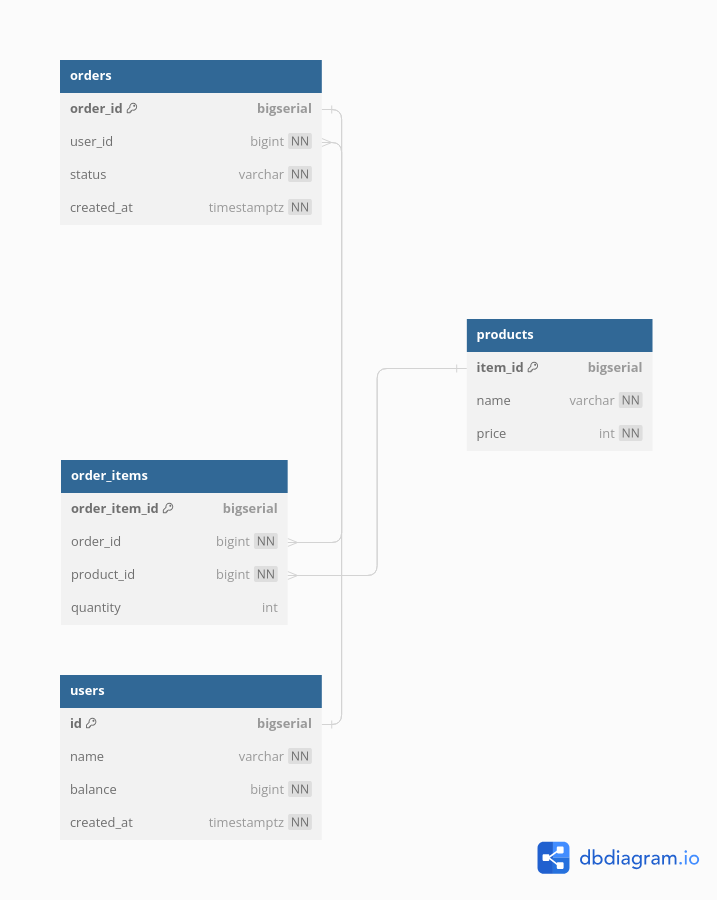

# Rest API
Using the common HTTP request patterns, it is possible to structure requests in a clear manner. The five following request types are used exclusively: GET, POST, PUT, PATCH, DELETE.

*Idempotent: An action if repeated multiple times should produce the same result.*

- GET: Used for non-modifying tasks, commonly reads. It should be free of side-effects, and also be idempotent.
- POST: Used to create new data, used most commonly at a common endpoint such as /blogs, but can also be used for adding a new resource to e.g. blogs/id/5, however less idiomatic.
- PUT: Used to update existing data. In contrast to POST it is idempotent. It is less commonly used to create new data as such operations should go through an appropiate handler. 
- PATCH: Update subset of data and leaves unspecified fields unchanged.
- DELETE: Used most commonly to delete a specific resource.

## URL best practices
An URL should describe the entity using easy to understand words. An url enpoint for users should be in lowercase and pluralized in order to be considered idiomatic.

## Backward and forward compatability

## Request caching

## Create Entity-Relationship Diagrams
[dbdigram](https://dbdiagram.io/home)

Dbdigram uses database themarkup language (DBML) syntax.

[DBML docs](https://dbml.dbdiagram.io/docs/)

## Relationships



## PostgreSQL

```
CREATE TABLE "users" (
  "id" bigserial PRIMARY KEY,
  "name" varchar NOT NULL,
  "balance" bigint NOT NULL,
  "created_at" timestamptz NOT NULL DEFAULT (now())
);

CREATE TABLE "products" (
  "product_id" bigserial PRIMARY KEY,
  "name" varchar UNIQUE NOT NULL,
  "price" int4 NOT NULL
);

CREATE TABLE "orders" (
  "order_id" bigserial PRIMARY KEY,
  "user_id" bigint NOT NULL,
  "status" varchar NOT NULL,
  "created_at" timestamptz NOT NULL DEFAULT (now())
);

CREATE TABLE "order_items" (
  "order_item_id" bigserial PRIMARY KEY,
  "order_id" bigint NOT NULL,
  "product_id" bigint NOT NULL,
  "quantity" int4 NOT NULL
);

CREATE INDEX ON "users" ("name");

ALTER TABLE "orders" ADD FOREIGN KEY ("user_id") REFERENCES "users" ("id");

ALTER TABLE "order_items" ADD FOREIGN KEY ("order_id") REFERENCES "orders" ("order_id");

ALTER TABLE "order_items" ADD FOREIGN KEY ("product_id") REFERENCES "products" ("product_id");

```

## Database migration

Migrate up is used to make a forward change to the database while down reverts it. Might need to drop tables in correct order if it has foreign key contraints. 

## Database ORM

It is possible to use the standard library to handle the mapping between database and golang types. Also sqlx is a more convenient option that is still lightweight. Gorm is convenient but opinionated. Sqlc is code generation for sql queries. 

*See sqlc documentation [here](https://docs.sqlc.dev/en/stable/tutorials/getting-started-postgresql.html)*

## Testing in Go

By convention put the test in the same folder as the original file with suffix _test. 

## Database transaction

A set of operations that all succeed or none does. Works through system failure or through multiple concurrent accesses to the database. 

## CI/CD with Github Actions
See the Github Actions documentation [here](https://docs.github.com/en/actions)

### Define a workflow
A procedure made up of 1 or more jobs that are triggered through events, schedule or manually.

### Runners
A job is assigned to a runner through a server. A runner will report the progress, logs and result to Github.

### Jobs
A set of steps to execute on the same runner. Can be run in parallel or serially if required. A job contains different steps (individual tasks) and are run serially within a job. A step is further divided into one or more actions. Actions may be reused for workflows.